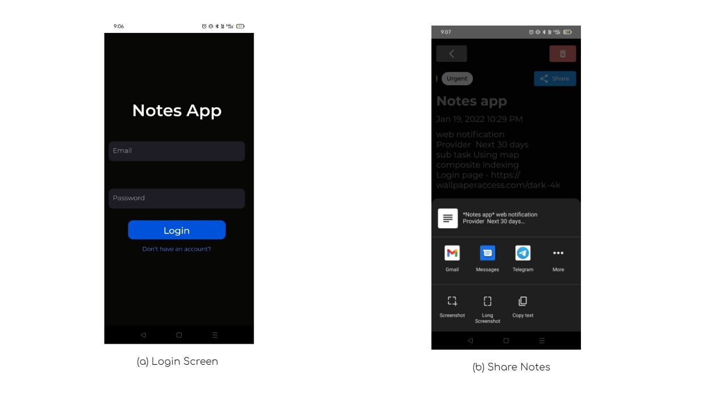
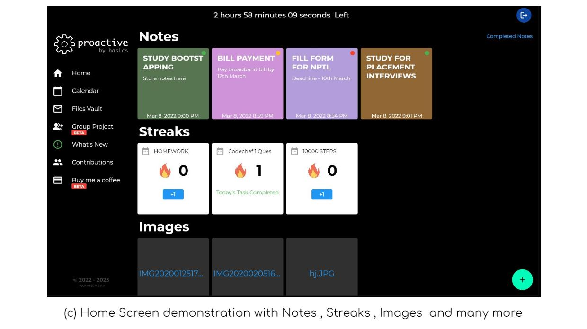
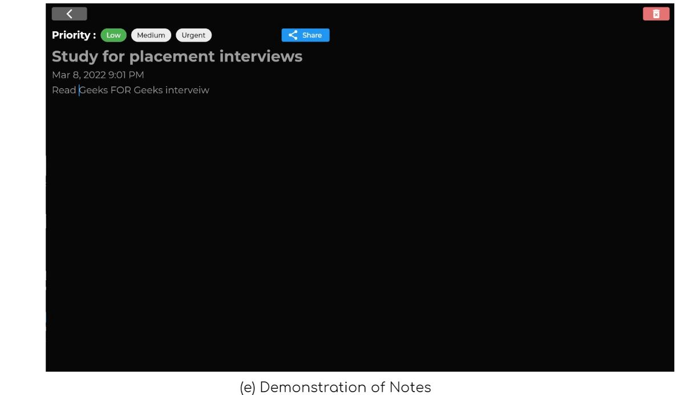

# Proactive
https://notesapp-6268f.web.app/#/

## What is Proactive ?

Proactive is a simple tool which helps you to achieve difficult goals quickly..
ok, but how?

before telling how ,lets see why some goals looks difficult.

To achieve any new goal it requires time , patience and  consistency.
Most of us when starts a new goal to learn new thing, we were energetic but after few days or week we loose this energy and drop the plan to achieve that goal and switch to something else.
Now the questions is why we drop the plan ?
When the burden of doing it outweighs the joy, you starts forgeting your initial goal.
Some of these problem can be fixed by proactive.

Features:-
Task/Notes- When you open your app there ,First thing you will look is the task section, that are the tasks that you have to do that day . 
 (Helps in reducing time to decide what to do next, and have a clear goal for a day).
 
Streak :- By adding daily streaks to your tasks ,helps you be consistent and at the end of the day gives statisfaction .
 ( if you break a streak , counter again goes to 0 😭 , so be consistent 🙂).

files vault - save your important files in your personal vault.
 
(beta) Group project- When there is multiple people in a project to assign and track which task was given to whom is bit difficult .
(share notes files with group memeber and chat about the project)

(beta) Donate - If you like our app , donate via razor pay.

## Comming Soon.........
Google Calendar Integration
Phone Auth
statemanagement soon...........

## OVERVIEW/IMAGES

